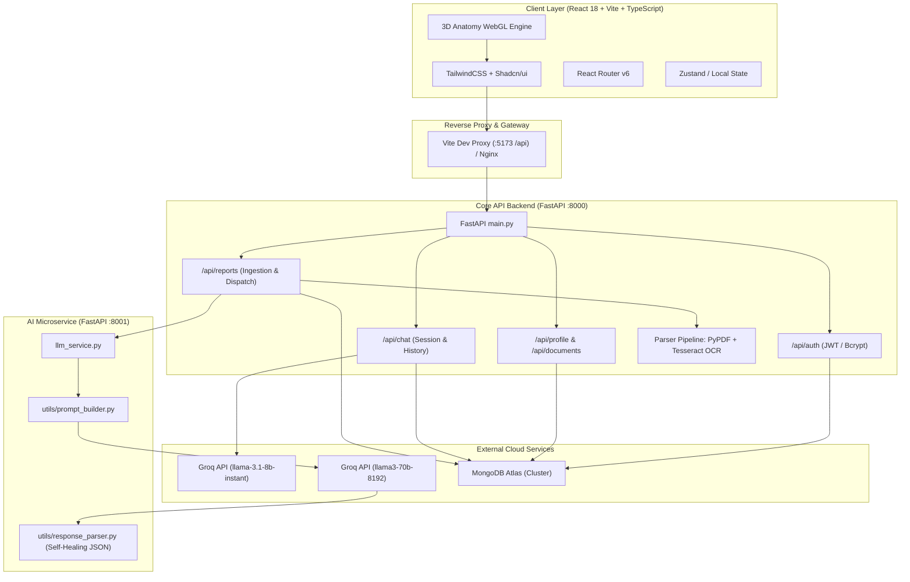
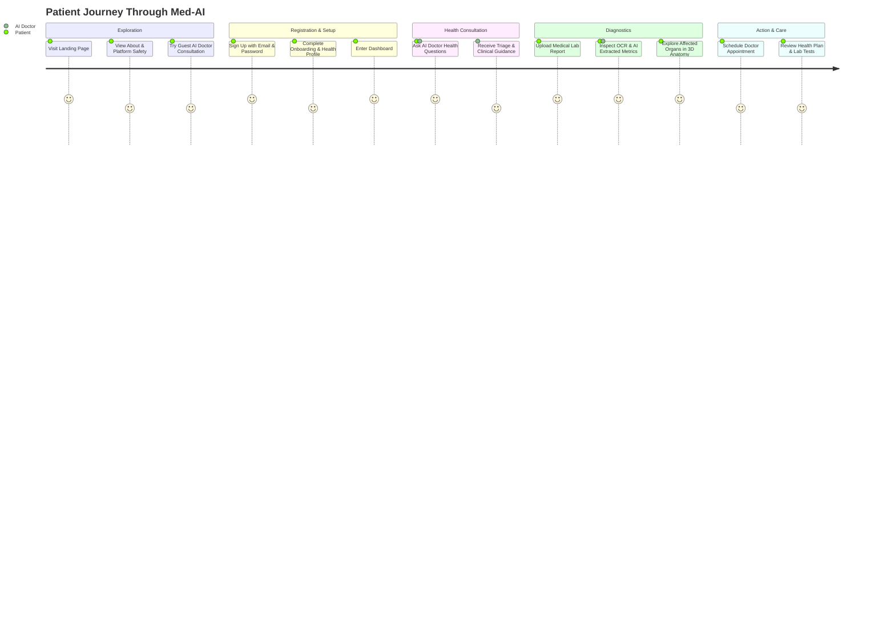
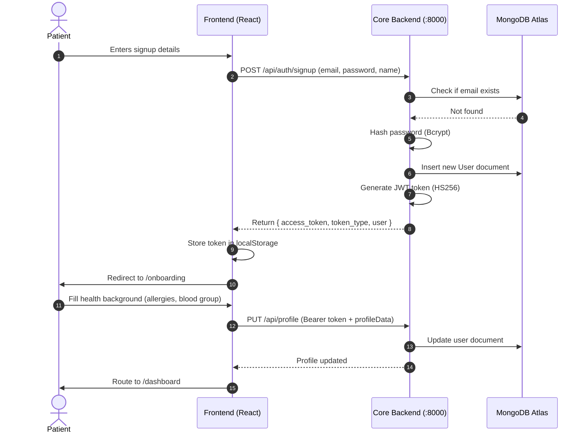
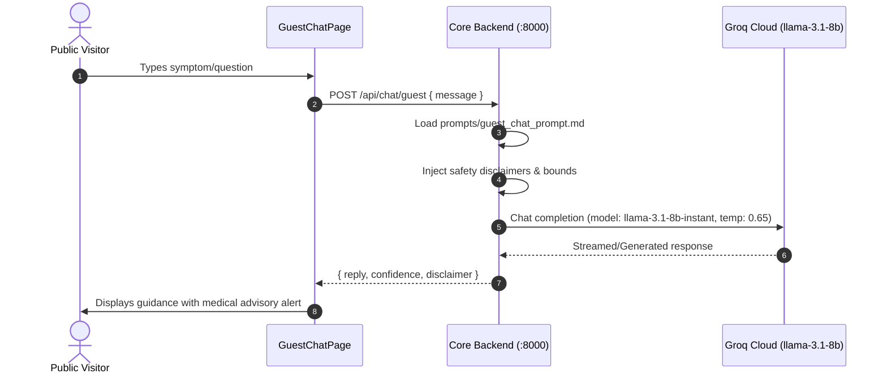
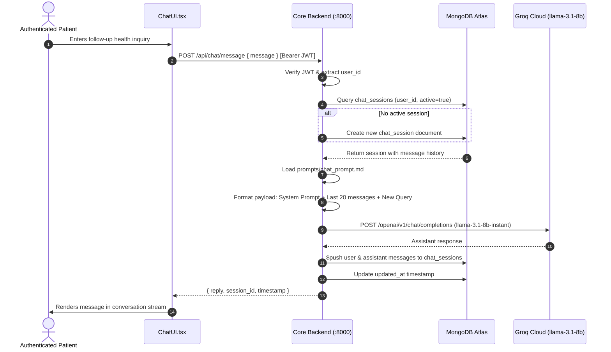
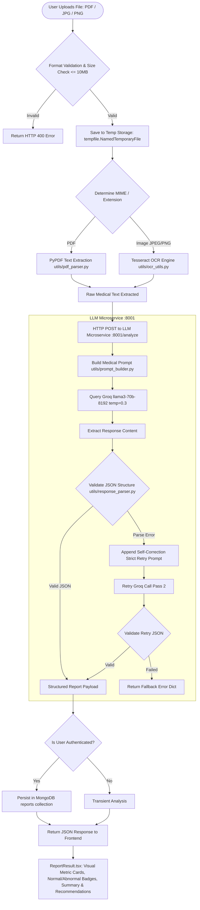
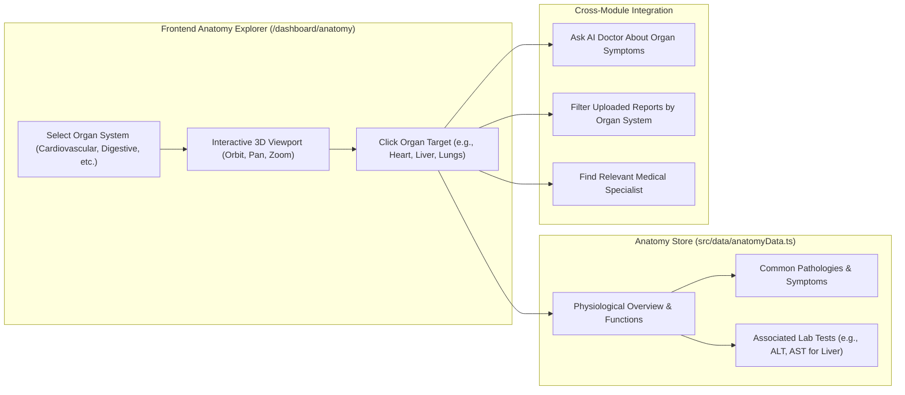
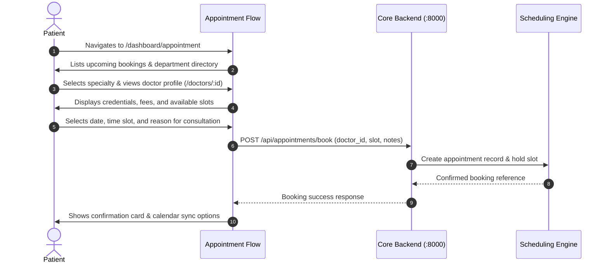

# 🏥 Med-AI — System Architecture & Workflow Specification

> **Version:** 3.0  
> **Last Updated:** April 2026  
> **System Components:** Frontend (`med-ai-v3/frontend-vite`), Core API (`med-ai-backend/backend` :8000), LLM Microservice (`LLM_Model/llm_service` :8001), Database (MongoDB Atlas), AI Inference Engine (Groq Cloud).

---

## 📋 Table of Contents

1. [High-Level System Architecture](#1-high-level-system-architecture)
2. [End-to-End User Journey](#2-end-to-end-user-journey)
3. [Authentication & Onboarding Workflow](#3-authentication--onboarding-workflow)
4. [AI Doctor Consultation Workflow](#4-ai-doctor-consultation-workflow)
   - [Guest Chat Flow (Stateless)](#41-guest-chat-flow-stateless)
   - [Authenticated Chat Flow (Context-Aware & Persistent)](#42-authenticated-chat-flow-context-aware--persistent)
5. [Medical Report Analysis Pipeline](#5-medical-report-analysis-pipeline)
   - [Document Ingestion & Text Extraction](#51-document-ingestion--text-extraction)
   - [LLM Service & Two-Pass JSON Parsing](#52-llm-service--two-pass-json-parsing)
   - [Report Data Persistence & Presentation](#53-report-data-persistence--presentation)
6. [3D Anatomy Viewer & Clinical Integration Workflow](#6-3d-anatomy-viewer--clinical-integration-workflow)
7. [Appointments & Clinical Services Workflow](#7-appointments--clinical-services-workflow)
8. [Runtime & Inter-Service Communication Flow](#8-runtime--inter-service-communication-flow)

---

## 1. High-Level System Architecture

The Med-AI platform follows a **decoupled, microservice-augmented architecture** designed for high responsiveness, secure health data handling, and fault-tolerant AI processing:



---

## 2. End-to-End User Journey



---

## 3. Authentication & Onboarding Workflow

### Workflow Details
1. **Registration (`POST /api/auth/signup`)**:
   - Client sends user details (name, email, password).
   - Backend hashes password using `passlib` (Bcrypt) and creates user record in `users` collection in MongoDB.
   - A JWT access token is minted using `python-jose` with an expiration window and returned to the client.
2. **First-Time Onboarding (`/onboarding`)**:
   - New users are routed to the Onboarding wizard to capture baseline clinical parameters (blood group, allergies, chronic conditions, emergency contact).
   - Saved directly to user document profile via `PUT /api/profile`.
3. **Session Management (`POST /api/auth/login`)**:
   - Validates user credentials.
   - Issues fresh JWT token stored in browser `localStorage`.
   - Attached automatically in `Authorization: Bearer <token>` header for all authenticated requests.



---

## 4. AI Doctor Consultation Workflow

Med-AI provides two distinct modes for medical consultation: **Guest Mode** (frictionless, privacy-centric, zero retention) and **Authenticated Mode** (contextual, historical, persistent).

### 4.1 Guest Chat Flow (Stateless)

- **Route:** `/chat` → `POST /api/chat/guest`
- **Characteristics:** Completely stateless, does not persist to database, applies strict disclaimer and educational boundaries.



---

### 4.2 Authenticated Chat Flow (Context-Aware & Persistent)

- **Route:** `/dashboard/chat` → `POST /api/chat/message`
- **Characteristics:** Tied to active session, reads recent conversation history (last 20 messages), persists conversation threads in MongoDB `chat_sessions`.



---

## 5. Medical Report Analysis Pipeline

The Medical Report Analysis system extracts, interprets, and categorizes clinical lab reports and imaging documents into actionable diagnostic intelligence.



### 5.1 Document Ingestion & Text Extraction
- **PDF Extraction:** Handled via `pypdf`, extracting page-by-page text streams while maintaining newline separators.
- **Image Extraction (OCR):** Uses Tesseract OCR with adaptive binarization, skew correction, and noise reduction for medical paper scans.

### 5.2 LLM Service & Two-Pass JSON Parsing
To prevent hallucination and format degradation, the system uses a **two-pass self-healing pipeline**:
1. **First Pass:** Strict zero-shot prompt enforcing JSON output:
   ```json
   {
     "patient_info": { "name": "", "age": "", "date": "" },
     "tests": [
       { "name": "", "value": "", "unit": "", "reference_range": "", "status": "normal|high|low" }
     ],
     "summary": "",
     "potential_concerns": [],
     "recommendations": []
   }
   ```
2. **Second Pass (Auto-Recovery):** If markdown fences or invalid tokens occur, `get_retry_prompt()` provides explicit correction feedback to Groq for deterministic output.

### 5.3 Report Data Persistence & Presentation
- Authenticated results are stored with metadata: `user_id`, `filename`, `file_type`, `analyzed_at`, and full structured analysis.
- The frontend renders abnormal tests in high-visibility alert states with medical reference guides.

---

## 6. 3D Anatomy Viewer & Clinical Integration Workflow

Med-AI incorporates an interactive 3D anatomical model that bridges report findings and symptoms with bodily systems:



---

## 7. Appointments & Clinical Services Workflow



---

## 8. Runtime & Inter-Service Communication Flow

During local development and production runtime, services collaborate over local sockets and cloud endpoints:

| Service | Port | Process Entrypoint | Role & Responsibility |
|---------|------|--------------------|-----------------------|
| **Frontend (Vite)** | `5173` | `npm run dev` | SPA host, client routing, UI state, WebGL 3D canvas |
| **Core API (FastAPI)** | `8000` | `uvicorn main:app` | Authentication, MongoDB CRUD, file upload, OCR, session router |
| **LLM Service (FastAPI)** | `8001` | `uvicorn LLM_Model.llm_service:app` | Text analysis, prompt construction, Groq LLM query & parsing |
| **MongoDB Atlas** | `27017` (Cloud) | Managed Service | Persistent store for users, profiles, chat logs, report analyses |
| **Groq Cloud API** | `443` (HTTPS) | `api.groq.com` | High-throughput inference for LLaMA models |

### Dual-Process Startup Execution
Both backend services are booted via the orchestrator script:

```bash
# From MED-AI-BACKEND/
./scripts/dev.sh
```

Which starts:
1. `uvicorn main:app --host 127.0.0.1 --port 8000 --reload`
2. `uvicorn LLM_Model.llm_service:app --host 127.0.0.1 --port 8001 --reload`

And the Vite frontend config proxies all `/api/*` calls from port `5173` seamlessly to port `8000`.
